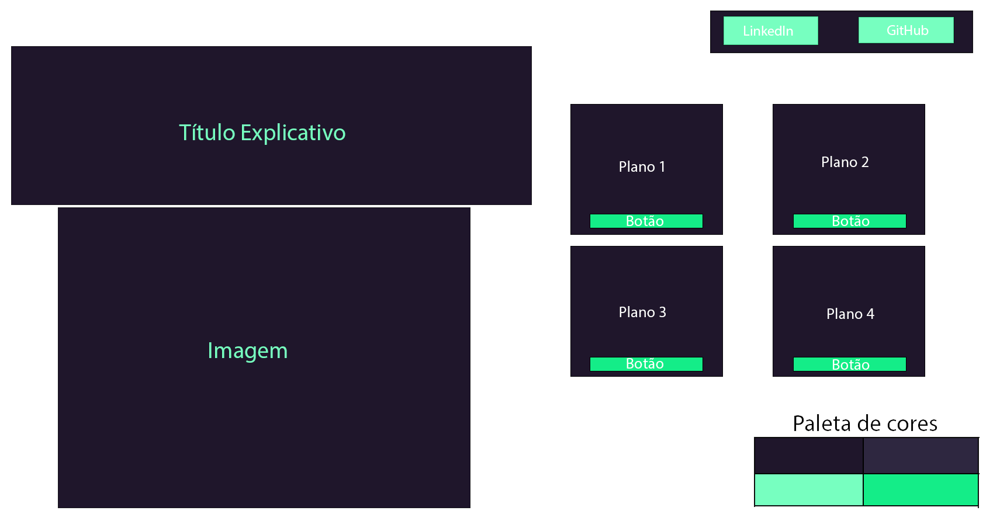
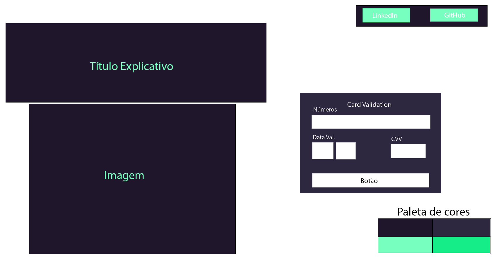
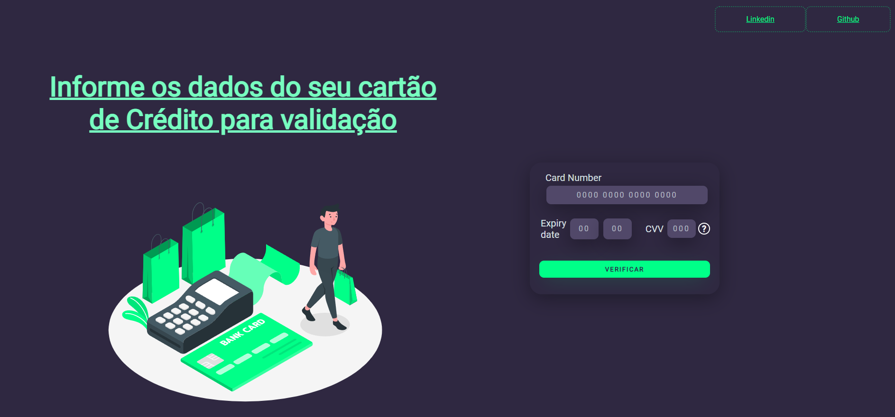

# Cartão de Crédito Válido

---

## Introdução

Neste projeto é usado o [algoritmo de Luhn](https://en.wikipedia.org/wiki/Luhn_algorithm), que é um método de soma de verificação,
usado para validar números de identificação, como o IMEI de telefones celulares, cartões de crédito etc.

---

## Resumo do projeto

Neste projeto, você consegue validar o número de um cartão de crédito.
Além disso, você terá seus dados protegidos pela funcionalidade de ocultação
dos dígitos do cartão, exceto os quatro últimos dígitos.

---

## Protótipo

---

## ✔️ Telas

---

## :robot: Tecnologias Utilizadas

- HTML 5
- CSS3
- JavaScript
- Node.js
